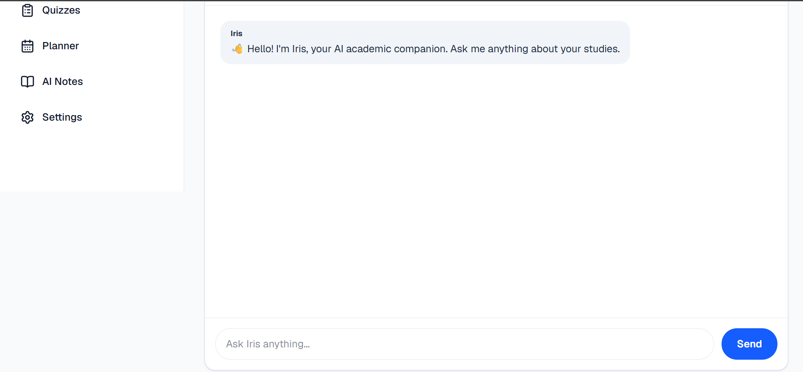
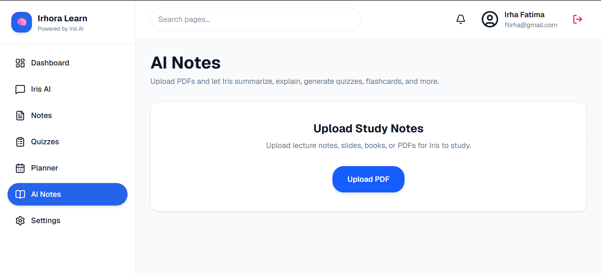
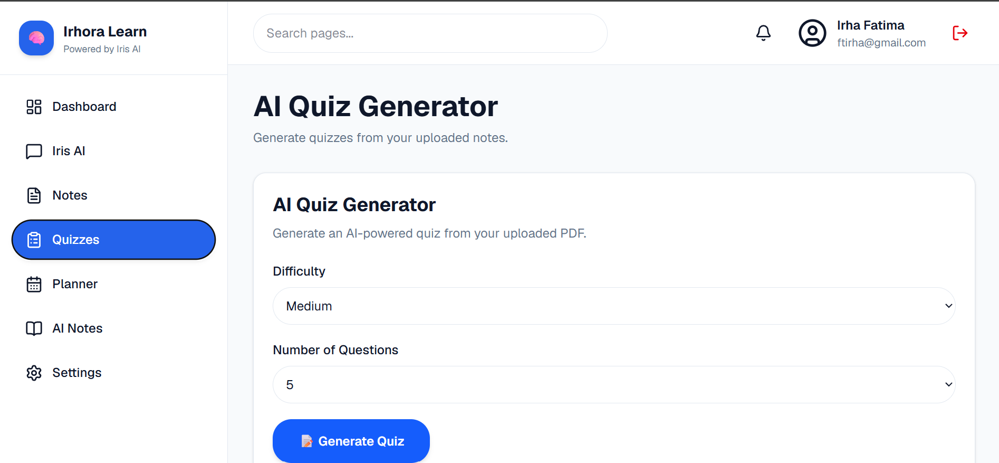
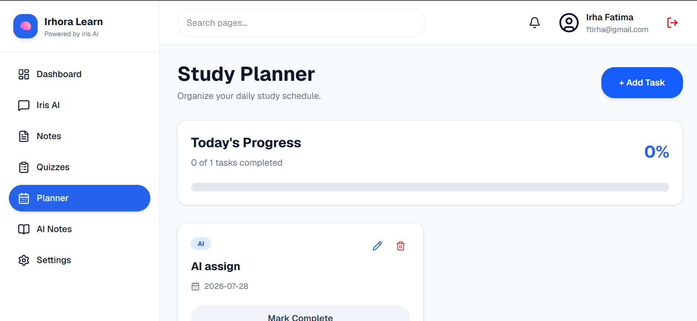

# 🎓 Irhora Learn

**An AI-Powered Academic Companion built with Next.js, Firebase, and Google Gemini AI.**

🌐 **Live Demo:** https://irhora-learn.vercel.app/

---

## 📖 Project Overview

Irhora Learn is an AI-powered learning platform designed to help students study more efficiently. It combines note management, AI tutoring, PDF analysis, quiz generation, and study planning into one modern web application.

The platform is powered by **Iris AI**, an intelligent assistant that helps students understand concepts, summarize documents, answer questions, and generate quizzes from uploaded study materials.

---

# ✨ Features

## 🏠 Landing Page
- Modern responsive landing page
- Smooth scrolling navigation
- Feature showcase
- About section
- Contact section

## 🔐 Authentication
- User Registration
- User Login
- Forgot Password
- Firebase Authentication

## 🤖 Iris AI
- AI-powered academic assistant
- Answers study-related questions
- Explains difficult concepts
- Markdown formatted responses

## 📄 AI Notes
- Upload PDF notes
- AI-generated summaries
- Ask questions about uploaded PDFs
- Intelligent document understanding

## 📝 AI Quiz Generator
- Generates quizzes from uploaded PDFs
- Multiple difficulty levels
- Custom number of questions
- Automatic scoring
- Retry quiz option

## 📚 Notes
- Create notes
- Edit notes
- Save note content
- Delete notes
- Firebase Firestore storage

## 📅 Study Planner
- Create study tasks
- Mark tasks as completed
- Delete tasks
- Track study progress

## ⚙️ Settings
- User profile settings
- Preference management

---

# 🛠️ Tech Stack

### Frontend
- Next.js 16
- React
- TypeScript
- Tailwind CSS

### Backend
- Next.js API Routes

### Database
- Firebase Firestore

### Authentication
- Firebase Authentication

### AI
- Google Gemini API

### Deployment
- Vercel

---

# 📂 Project Structure

```text
app/
components/
services/
lib/
hooks/
types/
public/
```

---

# 🚀 Installation

Clone the repository

```bash
git clone https://github.com/Irha-Fatimaa/irhora-learn.git
```

Navigate into the project

```bash
cd irhora-learn
```

Install dependencies

```bash
npm install
```

Create a `.env.local` file and add your Firebase and Gemini API credentials.

Run the development server

```bash
npm run dev
```

Open:

```
http://localhost:3000
```

---

# 🔑 Environment Variables

Create a `.env.local` file with the following variables:

```env
NEXT_PUBLIC_FIREBASE_API_KEY=
NEXT_PUBLIC_FIREBASE_AUTH_DOMAIN=
NEXT_PUBLIC_FIREBASE_PROJECT_ID=
NEXT_PUBLIC_FIREBASE_STORAGE_BUCKET=
NEXT_PUBLIC_FIREBASE_MESSAGING_SENDER_ID=
NEXT_PUBLIC_FIREBASE_APP_ID=

GEMINI_API_KEY=
```

---

# 🤖 AI Features

Irhora Learn uses **Google Gemini AI** to provide:

- Intelligent academic conversations
- Study assistance
- PDF summarization
- Question answering
- AI-powered quiz generation

---

# 📸 Screenshots

## Landing Page


## Dashboard


## Iris AI



## AI Notes



## Quiz Generator



## Study Planner



---

# 🔮 Future Improvements

- AI flashcards
- Dark mode
- Voice interaction
- Multi-language support
- Progress analytics
- Collaborative notes

---

# 👩‍💻 Author

**Irha Fatima**

GitHub:
https://github.com/Irha-Fatimaa

---

# 📄 License

This project was developed for educational purposes.